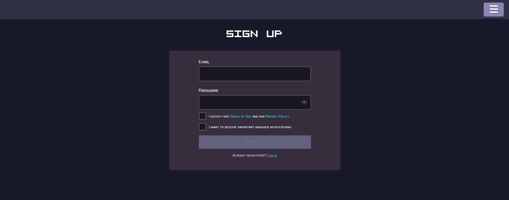

<h1>Retro Store</h1>

Online NFT Store Simulator | Misión TIC 2022

## 💬 Introducción

El presente proyecto sobre la creación de un sistema de gestión de servicios para el sector cripto simulando tokens no fungibles (NFT) sobre blockchain, forma parte de los estudios de la asignatura de **DESARROLLO DE APLICACIONES WEB: 2021-2-1711-W1-Presencial** del programa **Misión TIC 2022**. 

El enfoque del programa se interesa por que los tripulantes construyan progresivamente una **aplicación web en la nube totalmente funcional**. A partir del desarrollo de diversos saberes como la metodología Scrum, uso de frameworks, implementación de SPA (Single-page application) y desarrollo de componentes en distintos lenguajes de programación.

## ✋ Necesidad a satisfacer

Los tokens no fungibles son una tendencia que ha venido creciendo en los últimos años en el universo cripto. La creación de estos recursos nos permite generar arte en la blockchain, certificar propiedad y comercializar artículos exclusivos.

Los NFT poseen las siguientes características:

- Cada token representa un bien único e irrepetible
- No pueden ser subdivididos
- Exploran la escasez digital

Por otro lado, la demanda del arte y videojuegos retro presentan también una tendencia al alza. Despertando el interés en el mercado gracias a que los productos se encuentran fuera de producción.

Grandes compañías, como SONY o Nintendo, se han dado cuenta de esta tendencia. Por esta razón, han remasterizado y presentado al mercado nuevas versiones de sus productos más emblemáticos de la década de los 80s y 90s.

Debido a las razones expuestas, decidimos brindar a los potenciales usuarios una plataforma web en la que puedan encontrar todo lo relacionado al mercado retro. Con el objetivo de ofrecer artículos coleccionables, únicos e irrepetibles representados digitalmente. Activos digitales que poseen valor económico. Capaces de ser comprados y vendidos de forma fácil.

## 🚀 Misión

Ofrecer un servicio que simule para la comercialización de tokens no fungibles (NFT) por medio de una plataforma web que satisfaga parte de las necesidades del mercado en cuanto a coleccionables digitales de arte retro.

## 🎯 Objetivo

Desarrollar una aplicación web funcional con lo aprendido en el programa **Misión TIC 2022**, en donde los usuarios pueden comprar tokens no fungibles (NFT) que serán administrados o subidos en la plataforma por un administrador, utilizando la metodología Scrum, frameworks, implementación de SPA (Single-page application) y desarrollo de componentes en distintos lenguajes de programación brindados en el programa para brindar potenciales usuarios una plataforma web en la que puedan adquirir artículos coleccionables digitalmente, relacionados al mercado retro, capaces de ser comprados y vendidos de forma fácil.

Es importante tener en cuenta, que dicha aplicación se centrará en el proceso de administración y compra de dichos tokens, es decir, el desarrollo de la tecnología que permite crear los NFT no estará por el momento dentro del alcance del proyecto.

## 👨‍💻👩‍💻 Roles
A continuación, se presentar los roles y las funciones que cumplirá cada estudiante implicado en el desarrollo del proyecto.

| 🚀 Tripulante                       | Scrum Team Role         | Responsabilidades    |
|-------------------------------|-------------------------|--------------------|
| Gina Paola Becerra Corredor   | Scrum Master            | Group Leader       |
| Adrian Jose Garcia Corredor   | Development Team Member | Frontend Developer |
| Luis Antonio Mendoza Marriaga | Development Team Member | Frontend Developer |
| Victor Roca Salcedo           | Development Team Member | Backend Developer  |
| Raul Felipe Pineda Betancourt | Development Team Member | Backend Developer  |

## 📝 Product Backlog

Teniendo en cuenta las limitaciones de tiempo para realizar los siguientes desarrollos:

- Base de datos
- API Backend
- Frontend
- Despliegue a producción

Hemos compilado y organizado todas las historias de usuario necesarias para satisfacer las necesidades de nuestro cliente.

Sigue el **estado actual de nuestro Product Backlog** en 👉

## 📈 Diagrama UML

## 🖌️ Mockups

Login View

Store Main View

## 👍 ¿Te gusta el proyecto?
¡Déjanos una estrella ⭐ para saberlo y continuar motivados! 😃
## 📙 Referencias

- [iproup - ¿Qué es un NFT, para qué se usa y cómo se vende?](https://www.iproup.com/economia-digital/24021-que-es-un-nft-para-que-se-usa-y-como-se-vende)
- [Nintendo classic NES system to get re-release](https://ew.com/article/2016/07/18/nintendo-re-release-nes/)
- [Wingman Software | Planning Poker - The Original Paper](https://wingman-sw.com/articles/planning-poker)
- [Planning Poker Web](https://www.planningpoker.com/)