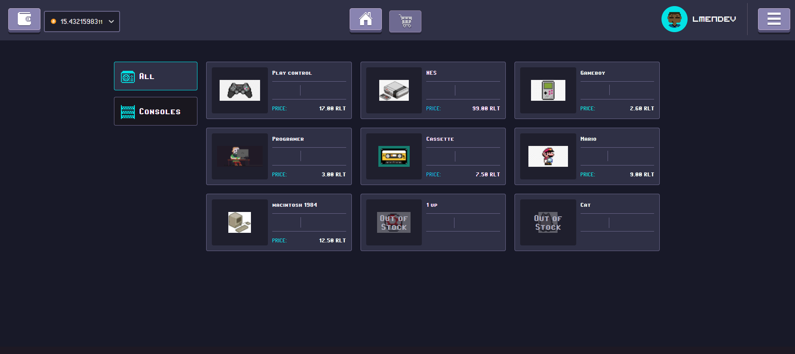

<h1>Retro Store</h1>

Online NFT Store Simulator | Misión TIC 2022

## 💬 Introducción

El presente proyecto sobre la creación de un sistema de gestión de servicios para el sector cripto simulando tokens no fungibles (NFT) sobre blockchain, forma parte de los estudios de la asignatura de **DESARROLLO DE APLICACIONES WEB: 2021-2-1711-W1-Presencial** del programa **Misión TIC 2022**. 

El enfoque del programa se interesa por que los tripulantes construyan progresivamente una **aplicación web en la nube totalmente funcional**. A partir del desarrollo de diversos saberes como la metodología Scrum, uso de frameworks, implementación de SPA (Single-page application) y desarrollo de componentes en distintos lenguajes de programación.

## ✋ Necesidad a satisfacer

Los tokens no fungibles son una tendencia que ha venido creciendo en los últimos años en el universo cripto. La creación de estos recursos nos permiten generar arte en la blockchain, certificar propiedad y comercializar artículos exclusivos.

Los NFT poseen las sigientes características:

- Cada token representa un bien único e irrepetible
- No pueden ser subdivididos
- Exploran la escasez digital

Por otro lado, la demanda del arte y videojuegos retro presentan también una tendencia al alza. Despertando el interés en el mercado gracias a que los productos se encuentran fuera de producción.

Grandes compañías, como SONY o Nintendo, se han dado cuenta de esta tendencia. Por esta razón, han remasterizado y presentado al mercado nuevas versiones de sus productos más emblemáticos de la década de los 80s y 90s.

Debido a las razones expuestas, decidimos brindar a los potenciales usuarios una plataforma web en la que puedan encontrar todo lo relacionado al mercado retro. Con el objetivo de ofrecer artículos coleccionables, únicos e irrepetibles representados digitalmente. Activos digitales que poseen valor económico. Capaces de ser comprados y vendidos de forma fácil.

## 🚀 Misión

[Explicar el ámbito y las restricciones del proyecto.]

[se deben presentar los objetivos y la misión del proyecto de manera clara y acorde con la necesidad a satisfacer.]

Se pretende desarrollar una aplicación web, en donde los usuarios pueden comprar tokens no fungibles (NFT) que serán administrados o subidos en la plataforma por un administrador. Es importante tener en cuenta, que dicha aplicación se centrará en el proceso de administración y compra de dichos tokens, es decir, el desarrollo de la tecnología que permite crear los NFT no estará por el momento dentro del alcance del proyecto.

## 🎯 Objetivos

Se pretende desarrollar una aplicación web, en donde los usuarios pueden comprar tokens no fungibles (NFT) que serán administrados o subidos en la plataforma por un administrador. Es importante tener en cuenta, que dicha aplicación se centrará en el proceso de administración y compra de dichos tokens, es decir, el desarrollo de la tecnología que permite crear los NFT no estará por el momento dentro del alcance del proyecto.

## 👨‍💻👩‍💻 Roles
A continuación se presentar los roles y las funciones que cumplirá cada estudiante implicado en el desarollo del proyecto.

| 🚀 Tripulante                       | Scrum Team Role         | Responsabilidades    |
|-------------------------------|-------------------------|--------------------|
| Gina Paola Becerra Corredor   | Scrum Master            | Group Leader       |
| Adrian Jose Garcia Corredor   | Development Team Member | Frontend Developer |
| Luis Antonio Mendoza Marriaga | Development Team Member | Frontend Developer |
| Victor Roca Salcedo           | Development Team Member | Backend Developer  |
| Raul Felipe Pineda Betancourt | Development Team Member | Backend Developer  |

## 📝 Product Backlog

Teniendo en cuenta las limitaciones de tiempo para realizar los siguientes desarrollos:

- Base de datos
- API Backend
- Frontend
- Despliegue a producción

Se describen a continuación todos los requerimientos priorizados necesarios para satisfacer las necesidades del cliente y desarrollar el proyecto.

|Atributos | Descripción | Orden | Estimación | Valor |
|----|--|--|--|--|
|[Se utilizan para agrupar y priorizar elementos]|[La descripción de la necesidad a resolver debe presentar el objetivo y la justificación.]

## 📈 Diagrama UML
[Diagrama UML adaptado al proyecto]

## 📙 Referencias
[iproup - ¿Qué es un NFT, para qué se usa y cómo se vende?](https://www.iproup.com/economia-digital/24021-que-es-un-nft-para-que-se-usa-y-como-se-vende)
